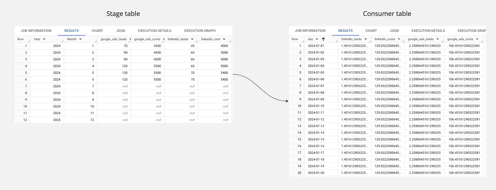
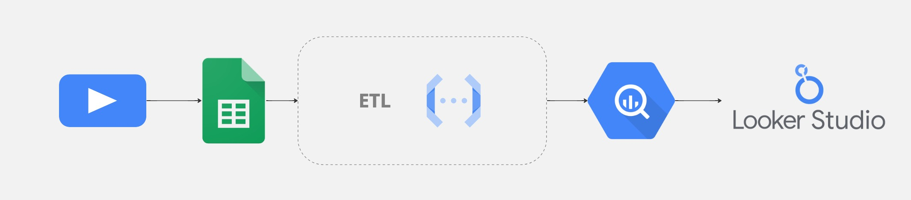

# benchmarks_ETL

## Overview

This project provides a solution for transforming monthly user input data from a Google Spreadsheet into daily benchmark values, which are then stored in a BigQuery table. The process involves extracting data per media per month, performing necessary transformations to calculate daily values, and seamlessly integrating the results into BigQuery for further analysis and visualization.

To deploy this code using Cloud Functions or Cloud Run, a few modifications are required to fit the specific deployment environment. These cloud services can further enhance the automation and scalability of the process.

By leveraging this code, you can efficiently compare your KPIs to your benchmarks and analyze your media data on a daily basis, empowering more granular insights and better decision-making.

## Key features:

- Data Extraction: Pulls monthly input data from a user-maintained Google Spreadsheet.
- Transformation: Converts monthly data into daily benchmark values.
- Storage: Saves the transformed data into a BigQuery table for easy access and analysis.

## Tools:

- Google Sheet for user input
- Python ETL (run on your local machine or deployed via Cloud Functions or Cloud Run)
- BigQuery for data warehousing and storage

## Output:

The consumer table must contain daily values for each media type. This allows stakeholders to compare numbers on a day-to-day basis throughout the month.

The consumer table includes the following columns:

- date: Each day in YYYY-MM-DD format
- benchmarks or each media: All benchmarks provided by the user in the spreadsheet, divided by the number of days in the respective month

## Data flow

## Example of a visualisation

